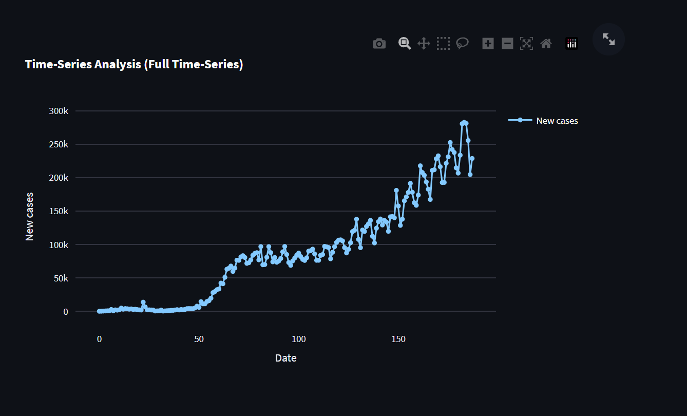

# TimPlot 

A simple application to plot time series data.

## Installation

``` pip install -r requirements.txt ```

## Usage

``` streamlit run main.py ```


## Screenshots

If no date column is provided, it will not be possible to plot the data against time.




